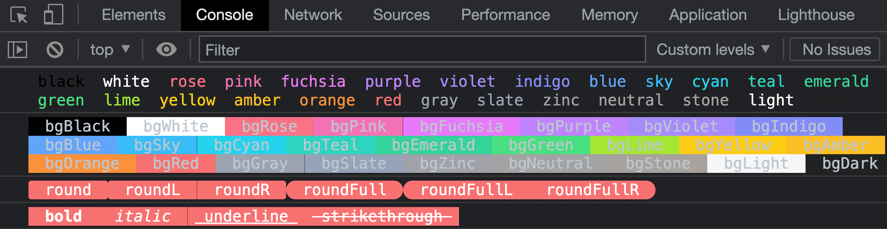

# craie

[](https://www.npmjs.com/package/craie)
[](https://bundlephobia.com/package/craie)
[](https://www.npmjs.com/package/craie)
[](https://bundlephobia.com/package/craie)
[](https://bundlephobia.com/package/craie)

<h2 align="center">
 🎨 Output colorful logs, much like <a href="https://github.com/chalk/chalk">chalk</a> but works for the browser.
</h2>

<p align="center">
  
</p>


## Usage

```ts
import craie from 'craie'

craie.log(craie.blue.bgRed.round('Message'))
```

## License

[MIT](./LICENSE) License © 2023 [Kricsleo](https://github.com/kricsleo)
