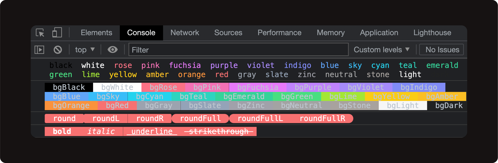

# craie

[](https://www.npmjs.com/package/craie)

Output colorful logs, much like [chalk](https://github.com/chalk/chalk) but works for the browser.

<p align="center">
  
</p>


## Usage

```ts
import craie from 'craie'

craie.log(craie.blue.bgRed.round('Message'))
```

## License

[MIT](./LICENSE) License © 2022 [Kricsleo](https://github.com/kricsleo)
